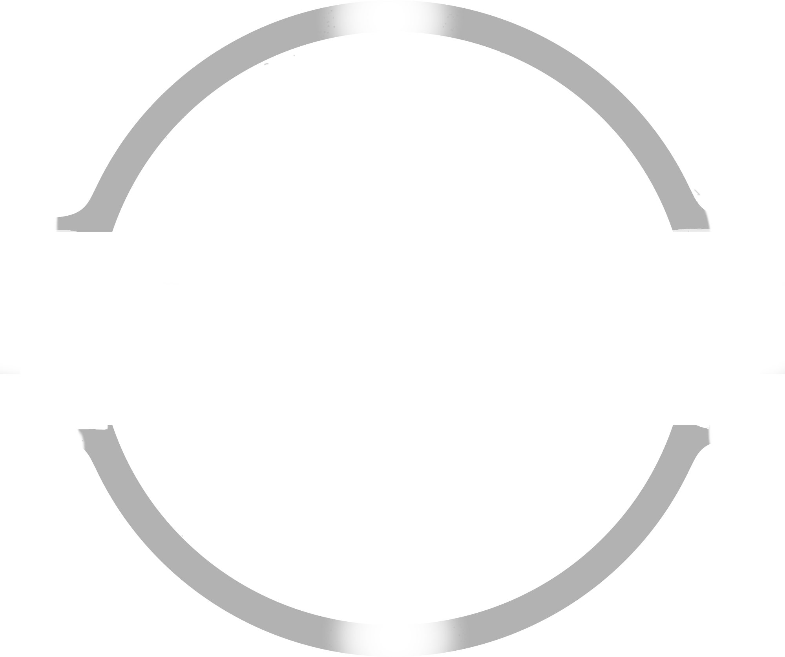
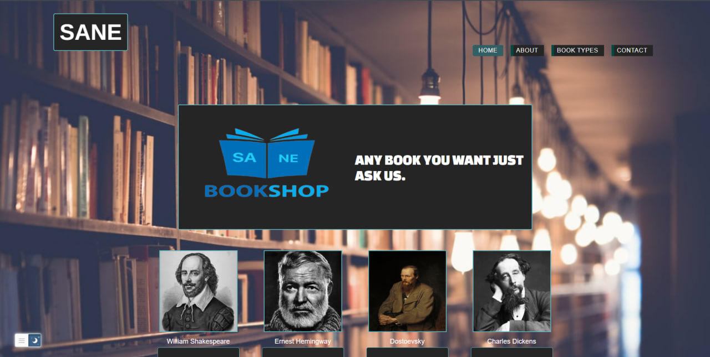

<!-- Improved compatibility of back to top link: See: https://github.com/othneildrew/Best-README-Template/pull/73 -->

<!--
*** Thanks for checking out the Best-README-Template. If you have a suggestion
*** that would make this better, please fork the repo and create a pull request
*** or simply open an issue with the tag "enhancement".
*** Don't forget to give the project a star!
*** Thanks again! Now go create something AMAZING! :D
-->

<!-- PROJECT LOGO -->
 

  

  <h3 align="center">Sane Book Shop</h3>

  

My First Year College Project - Sample Website
     
    <a href="https://github.com/asanes19/SaneBookShop"><strong>Explore the docs »</strong></a>
     
    <a href="https://asanes19.github.io/SaneBookShop/">View Demo</a>
  

<!-- TABLE OF CONTENTS -->

  
Table of Contents

  <ol>
    <li>
      <a href="#about-the-project">About The Project</a>
      <ul>
        <li><a href="#built-with">Built With</a></li>
      </ul>
    </li>
    <li>
      <a href="#getting-started">Getting Started</a>
      <ul>
        <li><a href="#prerequisites">Prerequisites</a></li>
        <li><a href="#installation">Installation</a></li>
      </ul>
    </li>
    <li><a href="#usage">Usage</a></li>
    <li><a href="#roadmap">Roadmap</a></li>
    <li><a href="#contributing">Contributing</a></li>
    <li><a href="#license">License</a></li>
    <li><a href="#contact">Contact</a></li>
    <li><a href="#acknowledgments">Acknowledgments</a></li>
  </ol>

<!-- ABOUT THE PROJECT -->
## About The Project

  

This repository contains my first-year college project, a simple and basic website that uses HTML, CSS, and jQuery. Though it may be a sample project, it holds a special place in my heart because it sparked my passion for web development. The website is fully responsive and works seamlessly on both mobile devices and laptops.

 

### Built With

## Project Description

The project is a website that showcases a virtual bookshop with a variety of books from different authors. It consists of the following main sections:

1. **Home Page:** The landing page welcomes visitors and provides an overview of the virtual bookshop. It introduces the website's purpose and highlights popular book categories.

2. **Books Page:** This page displays an extensive collection of books available in the virtual bookshop. Visitors can browse through the books, filter by genres, or search for specific titles. Each book is accompanied by its cover image, title, author, and a brief description.

3. **Authors Pages:** The website has dedicated pages for prominent authors, including:
   - William Shakespeare
   - Ernest Hemingway
   - Dostoevsky
   - Charles Dickens
   Each author's page provides biographical information, a list of their notable works, and related books available in the virtual bookshop.

4. **About Us Page:** The "About Us" page provides information about our team or the bookshop's history and mission. It allows visitors to learn more about the people behind the virtual bookshop and their passion for literature.

5. **Contact Page:** The contact page enables visitors to get in touch with the website owner or bookshop administrator. It includes a contact form where visitors can leave their messages, inquiries, or feedback.

 
 

<h3> 🙋‍♀️ Let's Connect </h3>

